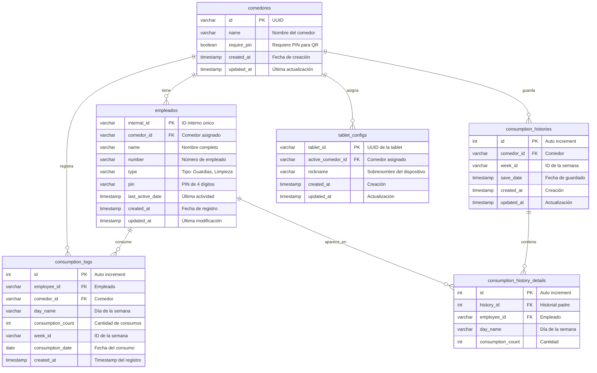
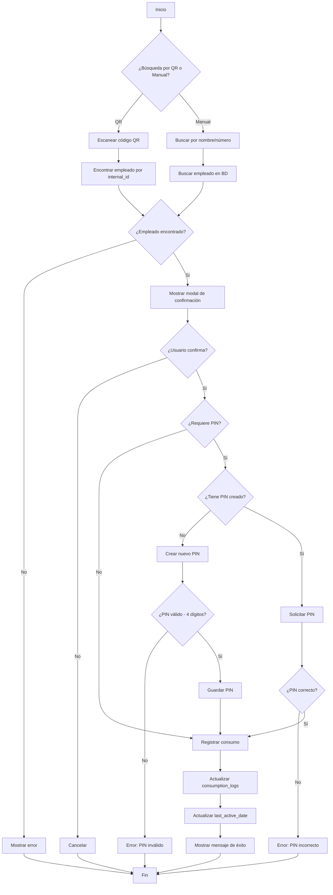
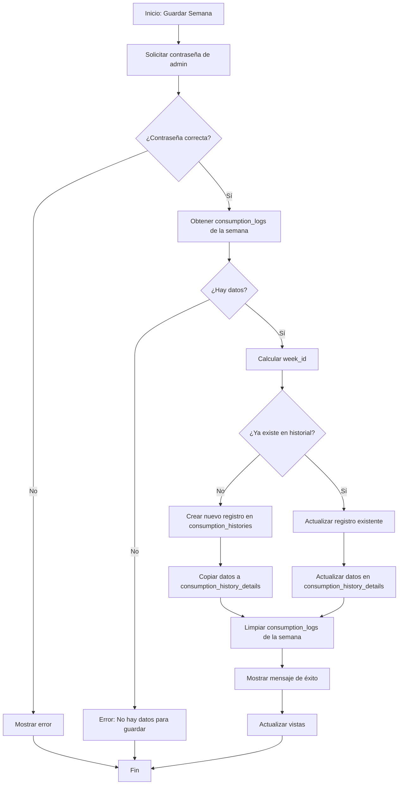
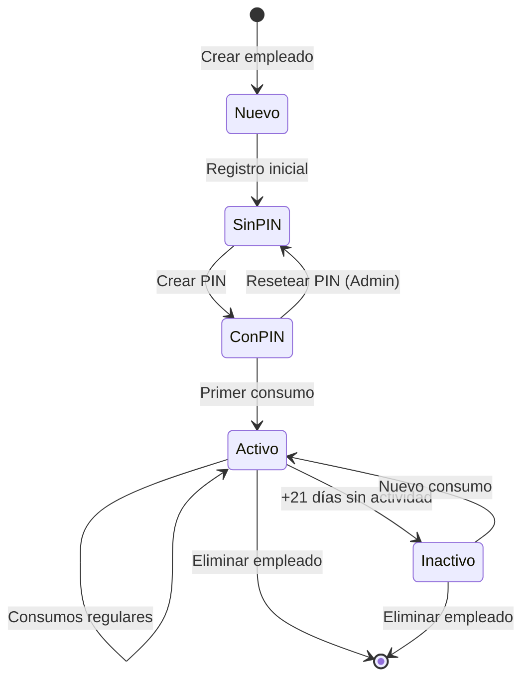
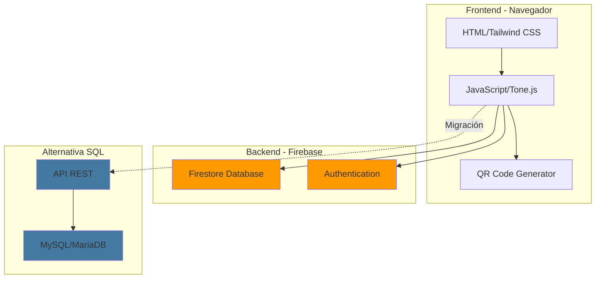
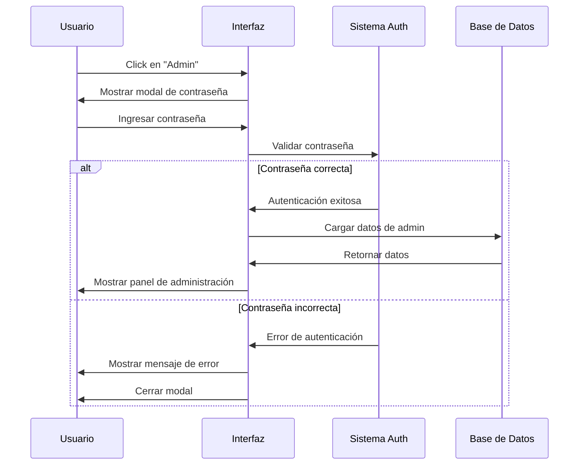
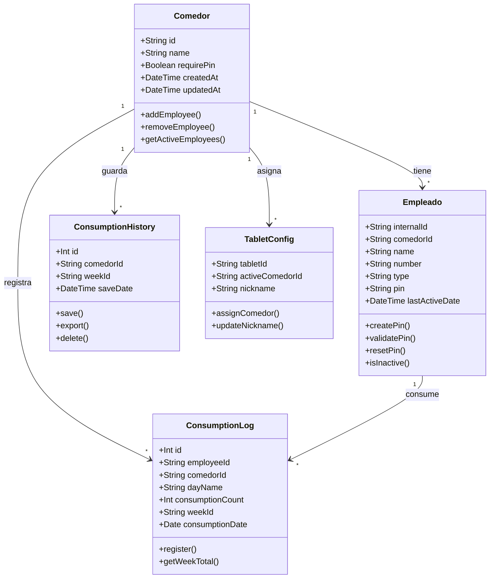

# Diagrama de Base de Datos - Formato Mermaid

Este archivo contiene el diagrama de la base de datos en formato Mermaid, que puede ser visualizado en GitHub, GitLab, o usando herramientas como Mermaid Live Editor (https://mermaid.live/).

## Diagrama Entidad-Relación (ERD)



## Diagrama de Flujo - Registro de Consumo



## Diagrama de Flujo - Guardar Semana en Historial



## Diagrama de Estados - Empleado



## Diagrama de Componentes - Arquitectura del Sistema



## Diagrama de Secuencia - Proceso de Autenticación Admin



## Diagrama de Clases - Modelo de Datos (Conceptual)



---

## Cómo Visualizar estos Diagramas

### Opción 1: GitHub/GitLab
Simplemente sube este archivo `.md` a tu repositorio y GitHub/GitLab renderizará automáticamente los diagramas Mermaid.

### Opción 2: Mermaid Live Editor
1. Visita: https://mermaid.live/
2. Copia y pega el código de cualquier diagrama
3. Visualiza y exporta como PNG/SVG

### Opción 3: VS Code
1. Instala la extensión "Markdown Preview Mermaid Support"
2. Abre este archivo en VS Code
3. Presiona `Ctrl+Shift+V` para ver la vista previa

### Opción 4: Herramientas de Documentación
- **Notion**: Soporta bloques de código Mermaid
- **Confluence**: Con plugins de Mermaid
- **Obsidian**: Soporta Mermaid nativamente

---

## Exportar Diagramas

Para exportar estos diagramas como imágenes:

1. **Usando Mermaid CLI:**
```bash
npm install -g @mermaid-js/mermaid-cli
mmdc -i database_diagram_mermaid.md -o diagrams/
```

2. **Usando Mermaid Live Editor:**
- Copia el código del diagrama
- Pega en https://mermaid.live/
- Click en "Actions" → "Export PNG" o "Export SVG"

---

## Notas

- Los diagramas Mermaid son texto plano, fáciles de versionar en Git
- Se actualizan automáticamente si cambias el código
- Son responsive y se adaptan al tamaño de la pantalla
- Puedes personalizar colores y estilos con temas de Mermaid
